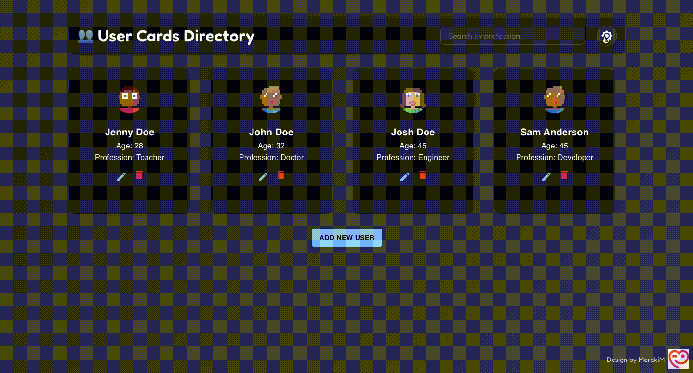
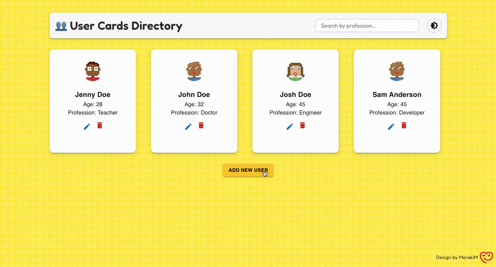
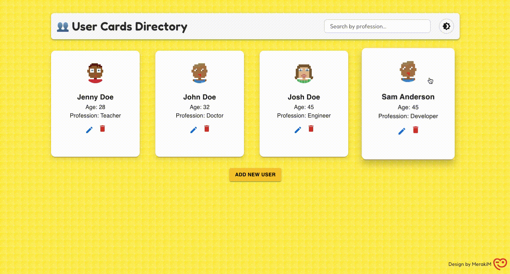

## 🌟 Flippable Profiles

Create, edit, delete, and flip interactive profile cards in a stylish, responsive UI!  
A playful and customizable React project with animations — perfect for portfolios, team directories, or personal dashboards. 💫



---

### ✨ Features

- 🔄 **Flip Cards** – Click to reveal more user details with a smooth 3D animation.
- ✏️ **Edit Profiles** – Update user info in a friendly modal.
- 🗑️ **Delete Cards** – Easily remove any user from the list.
- 🌈 **Light / Dark Mode** – Switch themes instantly.
- 🔍 **Filter by Profession** – Search users based on their profession.
- 🧸 **Polished UI** – Built with Material UI and custom styling.

---

### 📸 Previews

| Flip Animation | Modal Editing | Theme Toggle |
|----------------|---------------|----------------|
|  |  |  |

---

### 🛠️ Tech Stack

- ⚛️ **React** – Core framework
- 🎨 **Material UI (MUI)** – Component styling
- 🧠 **React State & Hooks** – Dynamic data updates

---

📦 flippable-profiles
 ┣ 📂public
 ┃ ┣ index.html
 ┃ ┣ logo.png / Merakilogo.JPG
 ┃ ┣ previews (.gif)
 ┣ 📂src
 ┃ ┣ App.js
 ┃ ┣ UserCard.js
 ┃ ┣ EditModal.js
 ┃ ┣ Footer.js
 ┃ ┣ data/
 ┣ README.md

---

### 🚀 Getting Started

```bash
git clone https://github.com/AqsaIrfan/flippable-profiles.git
cd flippable-profiles
npm install
npm start
